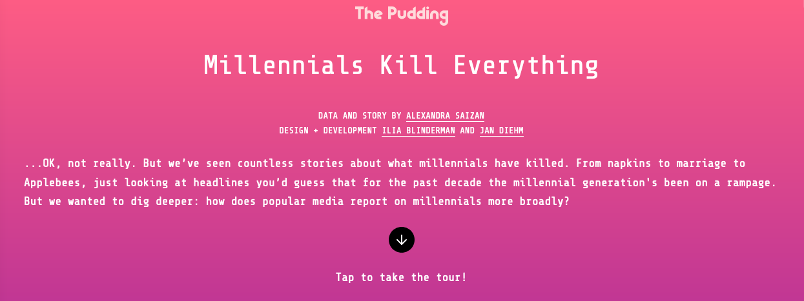

# The Millennial Question (Data Work) :thinking:

## Overview
This repository contains the programming script that cleaned the data behind the Pudding article named "The Millennial Question", published in October 2019.The finished article can be found here: https://pudding.cool/2019/09/millennials/. 

## About the Data
I used the [Event Registry News API](https://newsapi.ai/) to extract news articles with "millenial(s)" in the article title. I focused the API call on articles published from 2015-2019. A sample of articles extracted in the API call can be found in the file *Sample Articles.csv*.

## Data Cleaning Process

## Part-of-speech tagging
Using NLP methods such as part-of-speech tagging to further categorize scraped articles and identify sentence objects 

# Transforming the data into a consumable format for JavsScript
Transforming the text data into a multilevel structure for JavaScript parsing
  
